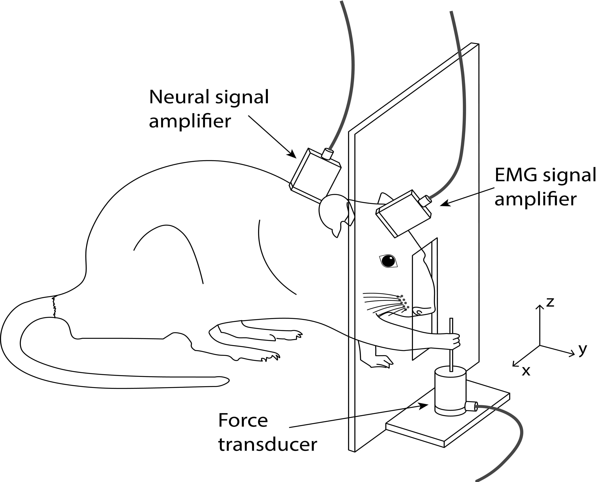
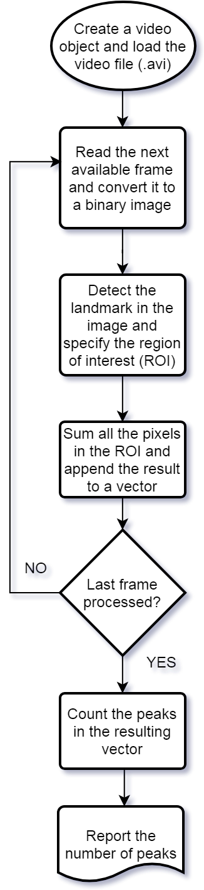

## Using an image processing package (OpenCV) to analyze video files

### Summary

Rodents are among the most popular animal models used in research studies. Rats, especially, can be trained to perform a variety of tasks to study motor disabilities, and psychological and cognitive disorders. When analyzing the rat behavior or using it as a dependent parameter, it is often required to use **repetitive** trials in which the rat performs a "similar" task. (A *trial* is defined as the learned task, such as reaching and grasping a food pellet, that is performed by rat over and over again and during which data is collected). Perhaps, the best method of identifying a particular task is to use a 3D tracking system with reflective markers attached to the rat's joints, although such systems can be very expensive. A cheaper and equally effective method might be using a simple USB camera that is strategically placed so that it can capture information from the images.

Figure 1. The behavioral task
  

---

### 1. Problem Definition  

The picture below demonstrates an experimental setup where neural, EMG, and force signals are being recorded simultaneously while the rat is performing a reach-to-pull task. In this task, the rat reaches through a window on its cage and pulls on a metal rod. The recording system automatically saves all the signals along with video images sampled at 30 frames/sec. Our goal is to group trials based on the number of reaches the rat performs, so that we can study each group seperately.

**Some important points to consider:**

* Rat can make ***single*** or ***multiple*** attempts until a successful pulling outcome
* Rat can ***reach multiple times*** before touching the rod for the first time
* Rat can rest its paw on the window before attempting to pull

**What about using a force sensor?**

Using a force sensor is probably the first and simplest solution we can think of. However, there it has a big drawback. We can detect reaches only if the animal makes contact with the rod. All other reaches would go unnoticed. We need a better approach where we can detect the reaches regardless of the final outcome (pulling vs. not pulling).

**What is the alternative?**

We can ***analyze the video recordings*** to figure out how many times rat attempted the pull in a given trial.

---

### 2. Image Processing using OpenCV-Python

Here is the basic flowchart that I implemented:
  

Figure 2. The flowchart
   
**Step 1:** Read the frames and convert it to gray scale
